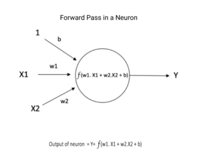

# Java实现神经网络

[参考资料](https://www.cnblogs.com/think90/articles/11568671.html)

## 例子1

## 例子二 （请查看包tds内代码）

[代码说明](https://towardsdatascience.com/understanding-and-implementing-neural-networks-in-java-from-scratch-61421bb6352c)

### 推理

### 训练